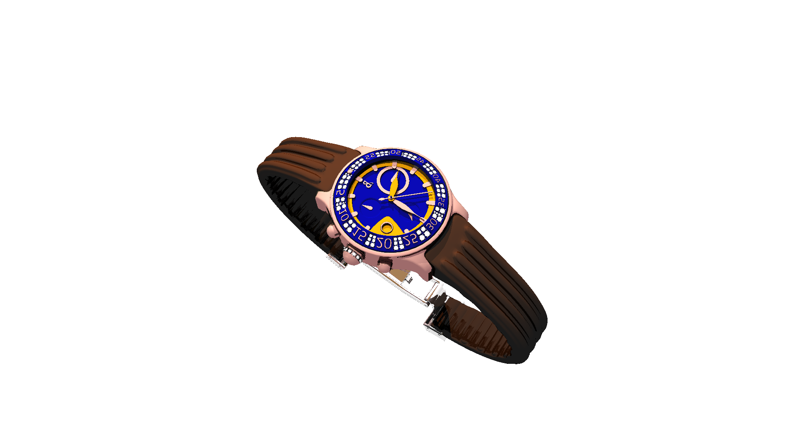

# Riley's Raytracer



## Overview

This is a raytracer that I built in a graphics class during my final semester
at the University of Minnesota in the spring of 2021. I've put a lot of work
into this, so I'd like to showcase it for anyone who'd like to see it.

With guidance from our professor Stephen Guy, the students in this class spent
three weeks creating raytracers. This is my implementation, which supports lots
of different cool features, like

- Arbitrary camera position and direction
- Arbitrary spheres and triangles with RGB colors
- Point lights, directional lights, and ambient lights
- Ambient, diffuse, and specular (Blinn-Phong) lighting
- Interpolation of triangle normals for smooth lighting
- Shadows
- Reflections to a bounded depth
- A bounding volume hierarchy (BVH) and parallelism with OpenMP for tracing acceleration
- PNG, JPG, BMP, and TGA output (with the `stb_image_write` library)
- Jittered supersampling (multiple samples per pixel for improved image quality)

## Using the Raytracer

If you'd like to try out the raytracer yourself, this repository should contain
most of what you need to get started. This project is built using `cmake`, so a
machine with `cmake` installed is also necessary.

To build the code for the project, try the following on a bash terminal from the
top-level repository directory (where this README is).

```bash
mkdir build
cd build
cmake -E env CXXFLAGS="-O3" cmake ../code # turn on aggressive compiler optimization
make # depending on what system you're using, CMake may generate a Makefile or some other way to build the code
./ray scene_file.txt
```

This project was built and tested on Ubuntu 18.04, so I don't know how it runs
on different OSes or different versions of Linux (but it shouldn't have many
issues between versions of Linux as far as I'm aware).

Some example scene files are in the `scenes` directory. These can be passed to
the `ray` executable to be traced.

## Examples

The `images` directory contains example images generated by this raytracer. Many
of the scene files / models for these scenes were given to us by Dr. Guy. They
do a good job of showing off various different features of the raytracer, like
shadows, reflections, interesting camera angles, and so on.

Some of my personal favorites are the watch images in `images/Challenge`. This
watch is incredibly detailed, and the raytracer took about 30 minutes to trace
it!
